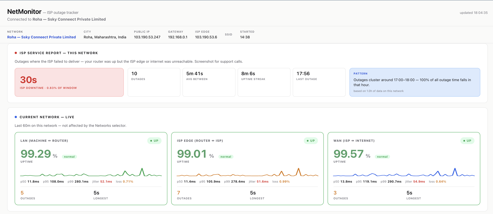
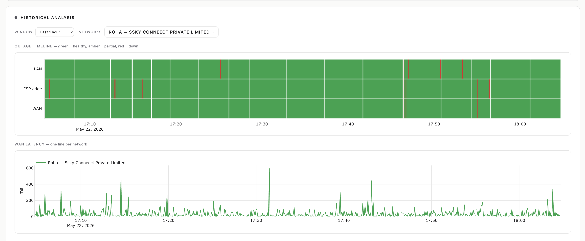
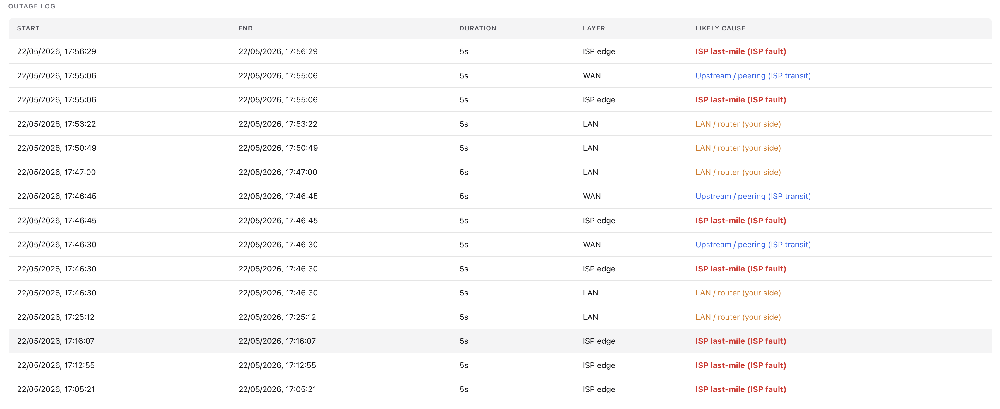

# netmonitor

A self-hosted, always-on probe that watches your home internet at three
distinct network layers and produces **attributed** outage evidence — so when
your ISP says "it's a problem on your side," you have data that says otherwise.

It pings your LAN gateway, your first ISP-side hop, and the public internet
every 5 seconds, tags each probe to a session bound to the physical network
you're on, and renders the result in a dashboard you can screenshot during a
support call.



## Why three layers?

A single end-to-end ping tells you *that* something failed, not *who* failed.
By probing three points on the path, every outage gets attributed:

| Layer       | What it probes                            | When it fails alone, the fault is… |
| ----------- | ----------------------------------------- | ----------------------------------- |
| **LAN**     | `ping` to the default gateway             | Your router, cable, Wi-Fi           |
| **ISP edge**| `ping` to the first non-private hop       | **ISP last-mile** (the smoking gun) |
| **WAN**     | `ping` to `1.1.1.1` and `8.8.8.8`         | ISP upstream / peering              |

The ISP-edge hop is discovered via `traceroute` and re-discovered every
~30 minutes, so reroutes don't quietly blind the monitor.

## What you get on the dashboard

**Top of page — ISP service report and live status.** The red card is the
ISP-attributed downtime against your selected window (the only number worth
showing the ISP). Live cards underneath show each layer's uptime, an RTT
sparkline, and p50 / p95 / p99 / jitter / loss for the last 60 minutes.

A pattern-insights panel highlights things like *"100% of all outage time
falls in 17:00–18:00"* — useful when complaining about a daily flap.

**Historical analysis.** A heatmap timeline per layer (green = healthy,
amber = partial loss, red = down) plus a WAN latency line chart over the same
window. Zoom syncs across both charts.



**Outage log.** Every outage in the window with its attributed cause. ISP
last-mile faults are highlighted — those are the ones worth talking about.



The **Networks** multi-select lets you scope the historical view to a
specific physical network (city — ISP). The current-network live cards always
reflect *where you are right now*, regardless of the historical scope.

## Session model

Each contiguous run of probes belongs to a `sessions` row that captures:
gateway IP + MAC, interface, SSID, ISP-edge IP, public IP, ISP name, city,
region, country. A session ends and a new one opens whenever the physical
network changes (gateway MAC or SSID flip). This is what keeps historical
data attributable when you move between home / office / coffee shop, and it's
how the dashboard knows which probes belong to *this* network vs. all
networks in the window.

`init_db` keeps old data safe across schema changes by renaming legacy tables
(`probes_legacy_v1`) rather than dropping them.

## Platform support

**macOS only**, today. The monitor leans on a handful of BSD/Apple-specific
commands and on `launchd` for lifecycle management:

| Layer        | Why it's macOS-only                                                              |
| ------------ | -------------------------------------------------------------------------------- |
| Discovery    | `route -n get default`, `ipconfig getsummary`, `arp -n` (BSD flags / macOS-only) |
| Probing      | `ping -W <ms>` uses macOS-style milliseconds (Linux `-W` is seconds)             |
| Scheduling   | `launchd` plists for the monitor / cleanup / dashboard jobs                      |
| Sleep policy | `pmset -c disablesleep` to keep the daemon alive lid-closed                      |

**Linux** is a straightforward port but not implemented: replace
`route -n get default` → `ip route show default`, `ipconfig getsummary` →
`iw dev <iface> link` for SSID, fix the `ping -W` units, and swap `launchd`
plists for a systemd user unit + timer. PRs welcome.

**Windows is not supported and there are no plans to port.** The ping CLI
contract, network discovery, and scheduling layers are all too different —
it would be a rewrite, not a port.

## Quick start

```bash
# 1) Python dep — Flask, for the dashboard only
pip install -r requirements.txt

# 2) Vendor the Plotly bundle locally
#    (some ISPs MITM cdn.plot.ly with a block page — see DECISIONS.md)
./nm setup

# 3) Install the launchd jobs (monitor daemon + daily cleanup at 03:30)
./nm install
#   …or also install a permanent dashboard service:
./nm install --with-dashboard

# 4) Confirm
./nm status

# 5) Open the dashboard (foreground, Ctrl+C to stop)
./nm dashboard
```

Then visit <http://localhost:8080>.

## CLI

`./nm` dispatches to standalone shell scripts in `bin/`. Each one is
self-contained and invokable directly.

| Command            | What it does                                                         |
| ------------------ | -------------------------------------------------------------------- |
| `./nm setup`       | Download vendored Plotly bundle into `static/`                       |
| `./nm install`     | Install monitor + cleanup launchd jobs (add `--with-dashboard` for the UI service) |
| `./nm uninstall`   | Remove all launchd jobs (DB and logs are preserved)                  |
| `./nm reload`      | Restart the monitor daemon (use after editing `monitor.py`)          |
| `./nm status`      | Daemon health, recent activity, current session                      |
| `./nm storage`     | DB size, row counts, what's eligible for next cleanup                |
| `./nm cleanup`     | Run retention cleanup now (deletes probes older than 56 days)        |
| `./nm vacuum`      | Reclaim disk after a big cleanup (briefly pauses the daemon)         |
| `./nm dashboard`   | Run the dashboard in the foreground                                  |
| `./nm logs`        | `tail -F` monitor / cleanup / dashboard logs                         |
| `./nm backup`      | Online-safe snapshot of `netmonitor.db` into `backups/`              |

## Architecture

```
                    ┌──────────────┐
   route -n get   ──┤              │
   arp / ipconfig ──┤  discover()  │  Topology: gw, mac, iface, ssid,
   traceroute     ──┤              │            isp_edge, public_ip, isp,
   ip-api.com     ──┤              │            city, region, country
                    └──────┬───────┘
                           ▼
   every 5s   ┌──────────────────────┐   INSERT
   (parallel) │ probe gateway (LAN)  │   ─────► sessions  ─┐
              │ probe edge   (ISP)   │   ─────► probes ────┤   netmonitor.db
              │ probe 1.1.1.1 / .8.8 │                     │   (SQLite WAL)
              └──────────┬───────────┘                     │
                         │   every 60s: fingerprint?       │
                         │   every 30m: re-traceroute      │
                         ▼                                 ▼
                   close_session() ──► open_session()    Flask /api/status
                                                            │
                                                            ▼
                                                      dashboard (Plotly)
                                                            │
            launchd KeepAlive ──── monitor.py               │
            launchd 03:30 daily ── cleanup.py (RETENTION_DAYS=56)
            launchd (optional) ──── app.py :8080  ──────────┘
```

- **`monitor.py`** — stdlib only. ThreadPoolExecutor pings all targets in
  parallel each cycle so 4 probes still complete in ~1 ping-RTT, not 4×.
- **`app.py`** — Flask + Plotly. Single `/api/status` endpoint feeds the
  whole dashboard; SQL queries hit indexed timestamp / session / layer.
- **`cleanup.py`** — stdlib only. Daily retention sweep, runs
  `PRAGMA wal_checkpoint(TRUNCATE)` to bound WAL growth. Doesn't VACUUM —
  see `DECISIONS.md` for why.
- **`bin/*.sh`** — `set -euo pipefail`, all source `bin/_common.sh`.
- **`launchd/*.plist.template`** — rendered by `bin/install.sh` with absolute
  paths to the project dir and the active `python3` interpreter (launchd has
  no shell PATH, so shims like pyenv must be resolved at install time).

## Schema

```sql
sessions(id, start_ts, end_ts, gateway_ip, gateway_mac, interface, ssid,
         isp_edge_ip, public_ip, isp, asn, city, region, country, label)

probes(ts, session_id, layer, target, success, rtt_ms)
INDEX probes(ts), probes(session_id), probes(layer)
PRAGMA journal_mode=WAL;
```

- One row per probe per target per cycle — ~70k rows/day, ~3 MB/day.
- WAL mode lets the dashboard read while the monitor writes without
  blocking either side.
- 8-week retention (56 days) — bounded at ~170 MB worst case.

## Local-first, by design

Everything lives in `netmonitor.db` next to the scripts. The only outbound
call is to `ip-api.com` for geolocation, made at most **once per session**
(i.e., once per network change), not per probe. There's no telemetry, no
account, no cloud dependency.

## File layout

```
netmonitor/
├── nm                          # CLI dispatcher
├── monitor.py                  # daemon: probes LAN/ISP/WAN every 5s -> SQLite
├── app.py                      # Flask dashboard on :8080
├── cleanup.py                  # daily retention enforcement
├── requirements.txt            # flask
├── bin/                        # helper scripts (install, status, storage, …)
├── launchd/                    # plist templates (rendered by bin/install.sh)
├── static/                     # vendored Plotly (downloaded by ./nm setup)
├── docs/screenshots/           # dashboard screenshots used in this README
├── backups/                    # output of ./nm backup
├── netmonitor.db               # SQLite store (created at runtime)
├── *.log                       # stdout/stderr of each launchd job
├── README.md                   # you are here
├── DECISIONS.md                # design rationale ("why is it done this way")
└── CLAUDE.md                   # notes for future AI sessions on this repo
```

## Where to run it

The value of the data scales with how continuous it is, so think about *where*
this lives before you install.

**Best deployment — a small always-on machine on your home network.** A Mac
mini you've retired, a spare laptop docked lid-open, or any Mac that lives
plugged-in and awake. It probes 24×7 without you thinking about it, your
working laptop stays free, and the dataset is unbroken when an outage finally
happens at 3 AM and you want to point at it the next morning.

**Also fine — your work laptop, alongside everything else you do.** The
monitor is stdlib Python, sleeps between pings, and consumes ~0% CPU and a
few MB of RAM in steady state. It runs invisibly under `launchd` and won't
affect your work. The only catch is sleep: macOS pauses the daemon when the
lid closes or the machine sleeps, so probe history has gaps that mirror your
usage pattern. Useful for catching outages while you're at the desk; less
useful for *"what happened overnight."*

On AC power you can override sleep:

```bash
sudo pmset -c disablesleep 1   # disable sleep on AC (use sparingly)
sudo pmset -c disablesleep 0   # revert
```

Apple enforces clamshell sleep on battery — no override there. If you want
true 24×7 coverage from a laptop, run it lid-open or with an external display
attached.

## Troubleshooting

| Symptom                                          | Fix                                                                  |
| ------------------------------------------------ | -------------------------------------------------------------------- |
| Port 8080 in use                                 | `lsof -ti:8080 \| xargs kill`                                        |
| Dashboard shows "stale" for all layers           | Daemon isn't running. `./nm status`, then `./nm reload`              |
| `disk I/O error` after deleting the `.db` file   | Stale `.db-shm` / `.db-wal` — `rm netmonitor.db netmonitor.db-*`     |
| ISP-edge row stays blank in the heatmap          | First non-LAN hop drops ICMP. Re-discovered every ~30 min.           |
| Geolocation shows the wrong city                 | `ip-api.com` is approximate. Use the ISP name + public IP from the session card instead. |
| Charts render blank but the JSON looks fine      | Your ISP may be MITM-ing `cdn.plot.ly`. Run `./nm setup` to vendor Plotly locally. |

## What this can't tell you

The attribution is honest about what it sees, which means it's also honest
about what it doesn't.

- **It's a single vantage point.** All three layers are probed from one host.
  If LAN, ISP edge, *and* WAN all show packet loss at the same moment, this
  tool can't disambiguate "my Mac's network stack briefly wedged" from "every
  device in the house lost connectivity." A second probe on the same LAN
  (phone, Pi) would harden the claim; this tool by itself can't. The
  three-layer split is still strong evidence in practice, because the LAN
  layer staying green during ISP/WAN loss is exactly the asymmetric signal
  that points at the ISP — but be aware of the limit.
- **The ISP name comes from `ip-api.com`, not your billing relationship.**
  It's the carrier announcing your public IP via BGP, which is usually your
  ISP but isn't guaranteed to match the name on your invoice (wholesale
  arrangements, CGNAT, business uplinks all complicate this). The session
  also records the ASN (e.g., `AS7922 Comcast Cable Communications, LLC`)
  and your public IP — those are ground-truth and harder to dispute than the
  city/ISP labels.
- **Geolocation is approximate.** City/region come from a free IP database
  and can be wrong by tens or hundreds of kilometres, especially for mobile
  carriers and CGNAT. Treat the location as a label, not a measurement.
- **Gaps in the timeline mean "no data," not "no outage."** If the daemon
  was off — laptop asleep, machine rebooting, daemon crashed — the gap is
  silent. The heatmap shows it as missing; that's not the same as "uptime."

## Deliberately out of scope

- **No alerting / notifications.** This is a measurement tool, not a pager.
- **No multi-host coordination.** One machine, one DB.
- **No PDF/report export.** Screenshots of the dashboard *are* the report.
- **No cross-platform support.** macOS-only by design today (see *Platform
  support* above).

See [`DECISIONS.md`](DECISIONS.md) for the full *why* behind every
non-obvious choice (probe interval, SQLite over Postgres, vendored Plotly,
sessions over a single config, no auto-VACUUM, …).

## Uninstall

```bash
./nm uninstall                # remove launchd jobs, keep the data
rm -rf "$(pwd)"                # nuke everything (run from the repo root)
```

## License

Released under the [PolyForm Noncommercial License 1.0.0](LICENSE) — free to
use, modify, and share for any noncommercial purpose (personal, academic,
research, non-profit) with attribution. **Commercial use is not permitted.**

PolyForm Noncommercial is purpose-built for source-available software with
this exact intent. If you have a commercial use case, open an issue to
discuss a separate license.
